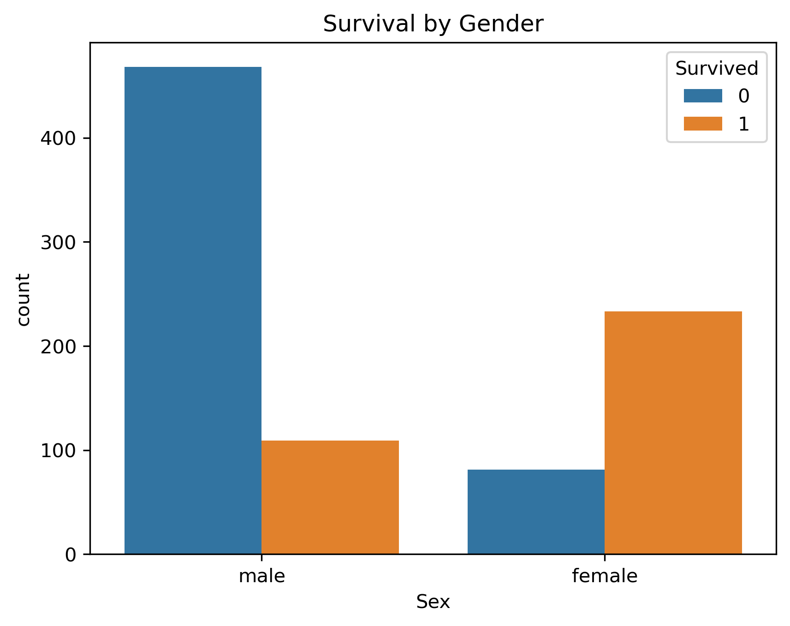

# EDA-101: Exploratory Data Analysis Project

Welcome! 👋  
This is my first project in a series where I practice **exploratory data analysis (EDA)** — the process of looking at a dataset, asking questions, and using visualizations to find insights.  

Think of this repo as a small case study that shows how I approach data: from raw files, to cleaned versions, to notebooks full of charts, and finally to clear takeaways.

---

## 📂 Project Layout
Here’s how the project is organized (so it feels like a real data science workflow):

- **data/raw/** → the original dataset (always kept untouched)  
- **data/processed/** → cleaned or transformed data, ready for analysis  
- **notebooks/** → Jupyter notebooks where the analysis and visualizations live  
- **reports/figures/** → saved charts and plots for quick viewing  
- **src/** → helper Python code (functions, scripts, etc.)  
- **tests/** → small tests to make sure the code runs correctly  

---

## 📊 Sample Result

Here’s one example from the analysis — survival by gender:



---

## 🚀 How to Try It Out
1. Clone the repo:
   ```bash
   git clone git@github.com:SharafThawfeek/eda-101.git
   cd eda-101
