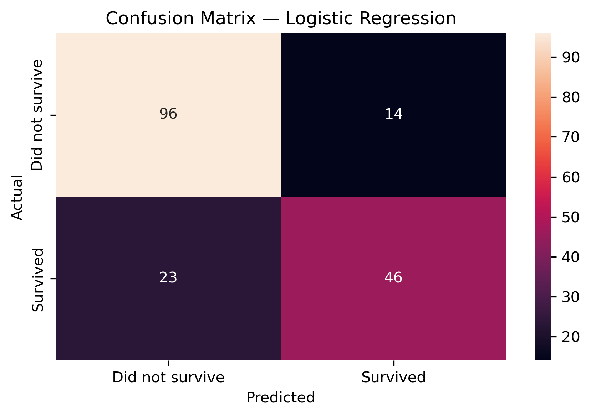

## 🧪 Pipeline Overview

Raw CSV ➜ **02_cleaning** ➜ `data/processed/titanic_clean.csv` ➜ **03_modeling** (features, train/test, evaluate) ➜ **04_results** (metrics + figures)

**Notebooks**
- [`01_eda.ipynb`](notebooks/01_eda.ipynb) – first look, questions, basic visuals  
- [`02_cleaning.ipynb`](notebooks/02_cleaning.ipynb) – handle missing values, save cleaned CSV  
- [`03_modeling.ipynb`](notebooks/03_modeling.ipynb) – features, Logistic Regression, metrics  
- [`04_results.ipynb`](notebooks/04_results.ipynb) – present metrics & figures

---

## ✅ Model Results (test set)

**Metrics**

| accuracy | precision | recall | f1 |
|---------:|----------:|-------:|---:|
| 0.780 | 0.760 | 0.710 | 0.730 |

> Replace the numbers above with yours from `reports/metrics.json` (or paste the auto-generated table printed in `04_results.ipynb`).

**Confusion Matrix**



---

## 🔧 What’s inside (short)

- **Cleaning choices:** `Age` → median impute; `Embarked` → mode; drop very sparse `Cabin`.  
- **Features:** `Pclass`, `Sex` (encoded), `Age`, `Fare`, `FamilySize`, `Embarked_*`.  
- **Model:** Logistic Regression baseline (simple, readable).  
- **Artifacts:** `reports/metrics.json`, figures in `reports/figures/`.

---

## ▶️ Run locally (optional)

```bash
git clone git@github.com:SharafThawfeek/eda-101.git
cd eda-101
pip install -r requirements.txt
# open notebooks/ and run 01 → 04 in order
